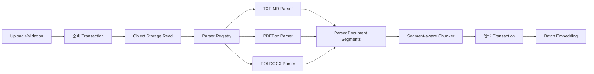

# #103 PDF·DOCX 문서 파싱 지원 추가 구현

## 1. 배경

현재 문서 인덱싱은 TXT와 Markdown 파일만 지원한다. 업로드 단계는 `txt`, `md` 확장자와 Content-Type만
허용하고, `DocumentParsingService`는 원본 Byte를 `TextDocumentParser`로 엄격하게 UTF-8 Decode한 뒤
`FixedSizeChunker`에 전달한다.

반면 데이터 모델에는 이미 `DocumentType.PDF`, `DocumentType.DOCX`와
`document_chunks.page_no`, `section_title`, `metadata_json`이 존재한다. 따라서 PDF·DOCX 지원은 새 DB
구조를 만드는 작업이 아니라, 형식별 파싱 결과를 기존 Chunk 원자 저장 경계에 연결하는 작업이다.

이번 작업은 텍스트가 포함된 PDF와 OOXML DOCX를 지원한다. OCR은 실행하지 않으며, 텍스트를 추출할 수
없는 PDF는 일반 파싱 실패와 구분해 후속 OCR 대상임을 명확히 보고한다.

## 2. 목표

1. PDF·DOCX 업로드를 안전한 확장자·Content-Type 조합으로 허용한다.
2. 문서 형식별 Parser 선택을 명시적인 계약으로 분리한다.
3. PDF Text를 페이지별로 추출하고 Chunk에 1부터 시작하는 Page Number를 저장한다.
4. DOCX Heading, 본문 Paragraph와 Table을 원본 순서대로 추출하고 Section Title을 저장한다.
5. TXT·Markdown의 기존 Canonical Text와 Chunk 결과를 변경하지 않는다.
6. 암호화·손상·빈·스캔 문서를 안정적인 오류 코드로 구분한다.
7. 외부 파싱 중 DB Transaction을 유지하지 않고 전체 Chunk Set 원자 저장을 보존한다.
8. 성공한 PDF·DOCX Chunk가 기존 Batch Embedding 단계에 그대로 연결되게 한다.

## 3. 제외 범위

- Tesseract 또는 다른 OCR Engine 실행
- 스캔 이미지 전처리, 회전 보정, 언어 감지
- 구형 Binary Word `.doc`
- HWP, HTML, PPTX, XLSX
- PDF 이미지·도형·주석·양식 필드 추출
- DOCX 내부 이미지 OCR
- Token 기반 Chunking 전환
- Query Embedding, Vector 검색, RAG, MCP 변경
- 공식 OpenSQL 17.8 원격 검증

## 4. 오픈소스 의존성

| 용도 | Library | Version | License | 선택 이유 |
| --- | --- | --- | --- | --- |
| PDF | Apache PDFBox | 3.0.8 | Apache-2.0 | Java 17에서 PDF Unicode Text와 페이지를 직접 추출 가능 |
| DOCX | Apache POI OOXML | 5.5.1 | Apache-2.0 | XWPF로 Paragraph, Heading, Table의 문서 순서를 읽을 수 있음 |

두 Library는 Apache Software Foundation의 공식 Release를 사용한다. 외부 SaaS, API Key, 상용 SDK나
실행 시 다운로드가 필요한 모델을 추가하지 않는다. 대회 Repository가 Open Source로 공개돼도 License
호환성을 설명할 수 있도록 의존성 용도와 Version을 이 문서에 고정한다.

OCR 후속 작업에는 Apache-2.0 License의 Tesseract를 별도 Process 또는 Container Sidecar로 두는 구성이
가능하다. Java Application에 Native OCR Runtime을 직접 포함하지 않고 현재 Parser 선택 경계 뒤에
선택형 Adapter로 연결한다.

## 5. 전체 구조



DB Transaction 경계는 변경하지 않는다.

```text
짧은 준비 Transaction
→ Transaction 밖 Storage 읽기·형식별 파싱·Chunk 계산
→ 짧은 완료 Transaction
```

## 6. 업로드 계약

`FileValidationService`는 다음 조합만 허용한다.

| Extension | DocumentType | Content-Type |
| --- | --- | --- |
| `txt` | `TXT` | `text/plain` |
| `md` | `MD` | `text/plain`, `text/markdown` |
| `pdf` | `PDF` | `application/pdf` |
| `docx` | `DOCX` | `application/vnd.openxmlformats-officedocument.wordprocessingml.document` |

`application/octet-stream`은 허용하지 않는다. 확장자만 PDF·DOCX인 임의 Binary가 업로드 단계에서 정상
문서로 오인되는 것을 줄이고, 저장된 `content_type`을 파싱 준비 단계에서 다시 검증할 수 있게 한다.

새 버전 업로드는 기존 문서의 `DocumentType`과 같은 형식만 허용하는 현재 계약을 그대로 사용한다.

## 7. 형식별 Parser 계약

### 7.1 DocumentContentParser

형식별 Parser는 다음 두 책임만 가진다.

```java
public interface DocumentContentParser {
    Set<DocumentType> supportedTypes();
    ParsedDocument parseDocument(byte[] content);
}
```

- `supportedTypes`: Registry Key로 사용하는 문서 형식 집합. 같은 Byte 계약을 공유하는 TXT·MD Parser는 두 형식을 함께 등록
- `parseDocument`: 원본 Byte를 DB나 Storage에 의존하지 않는 불변 파싱 결과로 변환

Parser는 Chunk 크기, Overlap, 영속화와 Worker 소유권을 알지 않는다.

### 7.2 DocumentParserRegistry

Spring이 제공한 Parser 목록을 `DocumentType`별 Map으로 고정한다.

- 같은 형식 Parser가 둘 이상 등록되면 기동 단계에서 실패한다.
- 현재 형식을 지원하는 Parser가 없으면 `UNSUPPORTED_DOCUMENT_TYPE`을 반환한다.
- `DocumentParsingService`는 구체적인 PDFBox·POI Class를 직접 참조하지 않는다.

이 경계는 후속 OCR Adapter를 PDF 기본 Parser와 섞지 않고 별도 정책으로 선택할 수 있게 한다.

## 8. 파싱 결과 계약

### 8.1 ParsedDocument

`ParsedDocument`는 원본 순서가 보존된 `ParsedDocumentSegment`의 불변 목록이다. 목록이 비었거나 모든
Segment가 공백이면 생성하지 않는다.

### 8.2 ParsedDocumentSegment

각 Segment는 다음 값을 가진다.

| Field | 의미 |
| --- | --- |
| `text` | 줄바꿈이 LF로 정규화된 검색 가능 Text |
| `pageNo` | PDF Page Number, 그 밖의 형식은 `null` |
| `sectionTitle` | DOCX 현재 Heading, 그 밖의 형식은 `null` |
| `metadataJson` | 필요한 경우에만 사용하는 최소 형식 Metadata |

Segment는 Page 또는 Section 경계다. Chunker는 Segment를 넘는 Chunk를 만들지 않는다.

TXT·Markdown은 기존 `TextDocumentParser.parse(byte[])` 결과를 단일 Segment로 감싼다. 기존 공개 Method는
단위 테스트와 단건 사용 경로를 위해 유지한다.

## 9. PDF 파싱

### 9.1 실행 순서

1. `Loader.loadPDF(byte[])`로 메모리의 PDF를 연다.
2. Password가 필요하거나 `PDDocument.isEncrypted()`이면 암호화 PDF 오류로 종료한다.
3. `PDFTextStripper`의 시작·끝 Page를 같은 값으로 설정해 페이지별 Text를 추출한다.
4. 각 Page Text의 CRLF·CR을 LF로 바꾸고 앞뒤 빈 공간만 제거한다.
5. 비어 있지 않은 Page를 해당 1-based Page Number의 Segment로 추가한다.
6. Page는 존재하지만 전체 Segment가 비면 OCR 필요 오류로 종료한다.

### 9.2 페이지 경계

Page 1의 마지막 Text와 Page 2의 첫 Text를 같은 Chunk에 넣지 않는다. 이 방식은 Chunk 하나에 Page Number
하나만 저장할 수 있는 현재 Schema와 일치한다.

페이지별로 Overlap을 다시 시작한다. 검색 결과의 출처 Page를 정확히 보존하는 것을 페이지를 가로지르는
긴 Context보다 우선한다.

### 9.3 오류

- `InvalidPasswordException`, Encryption 확인: `DOCUMENT_PDF_ENCRYPTED`
- Page는 있지만 추출 Text 없음: `DOCUMENT_OCR_REQUIRED`
- 잘못된 PDF Header, 손상된 Object, I/O 오류: `DOCUMENT_PARSING_FAILED`

오류 Log와 API 응답에 PDF Byte, 추출 Text와 Object Storage 경로를 포함하지 않는다.

## 10. DOCX 파싱

### 10.1 문서 순서

`XWPFDocument.getBodyElements()`를 순회해 Paragraph와 Table의 실제 Body 순서를 보존한다.

- Paragraph: `XWPFParagraph.getText()`
- Heading: Style ID가 `Heading`으로 시작하거나 `Title`인 Paragraph
- Table: Row는 LF, Cell은 Tab으로 결합

Header, Footer, Footnote와 Comment는 이번 범위에서 제외한다.

### 10.2 Section 구성

Heading을 만나면 이전 Section을 종료하고 새 Segment를 시작한다. Heading Text 자체도 새 Segment의 첫
줄에 포함한다. 다음 Heading 전까지 본문 Paragraph와 Table Text를 LF로 이어 붙인다.

첫 Heading 이전의 본문은 `sectionTitle = null`인 Segment로 유지한다. 같은 Section의 Table은 본문과
같은 Segment에 원래 순서대로 포함한다.

### 10.3 오류

- 검색 가능한 Paragraph·Table Text 없음: `DOCUMENT_CONTENT_EMPTY`
- 손상된 ZIP, OOXML Package, I/O 오류: `DOCUMENT_PARSING_FAILED`

Macro 포함 `.docm`과 Binary `.doc`은 업로드 단계에서 허용하지 않는다.

## 11. Segment 기반 Chunking

`FixedSizeChunker`는 기존 `chunk(String)`을 유지하고 `chunk(ParsedDocument)`를 추가한다. 문자열 Method는
단일 Segment Parsed Document로 위임해 TXT·Markdown의 결과를 유지한다.

각 Segment의 Unicode Code Point 배열에 기존 Chunk Size와 Overlap을 적용한다.

```text
Segment 1 local [0, 1000) → global [0, 1000)
Segment 2 local [0, 1000) → global [segmentStart, segmentStart + 1000)
```

전역 Offset은 Segment Text를 LF 하나로 연결한 개념적 Canonical Text를 기준으로 계산한다. Segment 사이
LF 한 Code Point를 Offset에 포함하지만 어떤 Chunk에도 저장하지 않는다.

Draft에는 Segment의 `pageNo`, `sectionTitle`, `metadataJson`을 복사한다. `chunkIndex`는 Segment와 관계없이
문서 전체에서 0부터 연속된다. Hash, Token 추정치, Unicode Surrogate Pair 보호는 기존 로직을 사용한다.

## 12. 원자성과 재개

1. 준비 Transaction이 Job, Attempt, Worker, Claim Token, Lease와 Version을 잠그고 검증한다.
2. 지원 형식과 Content-Type을 확인하고 Storage 위치·DocumentType Snapshot을 만든다.
3. Transaction 밖에서 원본을 읽고 Parser Registry와 Chunker를 실행한다.
4. 파싱 또는 Chunking이 실패하면 완료 Transaction을 호출하지 않아 Chunk Row는 0건이다.
5. 완료 Transaction이 소유권과 Version을 다시 검증한다.
6. 전체 Draft를 `saveAllAndFlush`, `CHUNKED` 상태와 Event로 같은 Transaction에서 Commit한다.
7. 동시 요청이 먼저 완료했다면 기존 Chunk Set을 재생한다.

PDF·DOCX 지원은 이 기존 계약을 변경하지 않는다.

## 13. 오류 계약

새 오류를 추가한다.

| ErrorCode | HTTP | 의미 |
| --- | --- | --- |
| `DOCUMENT_PDF_ENCRYPTED` | 422 | Password 또는 Encryption이 적용된 PDF |
| `DOCUMENT_OCR_REQUIRED` | 422 | Page는 있지만 검색 가능한 Text가 없는 PDF |
| `DOCUMENT_PARSING_FAILED` | 422 | 손상되거나 읽을 수 없는 PDF·DOCX |

기존 오류를 유지한다.

- `UNSUPPORTED_DOCUMENT_TYPE`
- `DOCUMENT_CONTENT_EMPTY`
- `DOCUMENT_TEXT_DECODING_FAILED`
- `DOCUMENT_FILE_REFERENCE_MISSING`
- `DOCUMENT_CHUNKS_INCONSISTENT`

Worker 실패 분류는 암호화·OCR 필요·내용 없음·형식 오류를 재시도 불가능한 문서 내용 오류로 처리한다.
Storage나 일시적인 Provider 장애와 혼동하지 않는다.

## 14. 테스트 설계

### 14.1 업로드

- 정상 PDF·DOCX 확장자와 Content-Type
- 대소문자 확장자 정규화
- PDF 확장자 + DOCX Content-Type 등 불일치
- `.doc`, `.docm`, `application/octet-stream` 거부

### 14.2 Parser 단위 테스트

- PDF 두 Page의 Text와 Page Number
- 한 Page가 비어 있어도 다음 Text Page 보존
- 전체 Text가 없는 PDF의 OCR 필요 오류
- Password 보호 PDF 오류
- 손상된 PDF 파싱 실패
- DOCX Heading, 본문, Table, 다음 Heading의 순서와 Section Title
- Heading 이전 본문
- 빈 DOCX와 손상 DOCX 오류
- TXT·Markdown Canonical Text 회귀

테스트 Fixture는 PDFBox와 POI로 메모리에서 생성한다. Binary Fixture를 Repository에 추가하지 않는다.

### 14.3 Chunk 단위 테스트

- Page·Section 경계를 넘지 않는 Chunk
- 문서 전체 연속 `chunkIndex`
- 전역 Character Offset
- 페이지와 Section Metadata 복사
- Unicode Code Point와 Overlap 기존 회귀

### 14.4 통합 테스트

- PostgreSQL 17에서 PDF·DOCX Chunk Row, Page·Section, 상태와 Event 저장
- 중간 Parser 실패 시 Chunk 0건
- 같은 실행의 순차·동시 재호출 수렴
- Worker Pipeline이 Parsing 이후 기존 Batch Embedding으로 진행
- 전체 Gradle Test

## 15. 보안과 운영

- 업로드 Content-Type만 신뢰하지 않고 실제 Parser가 Binary 구조를 검증한다.
- 압축 해제 Bomb 위험을 줄이기 위해 POI의 OOXML 기본 보호를 유지하며 파일 전체 크기는 기존 업로드 제한을
  적용한다.
- 문서 원문, PDF Password 시도, Vector와 Object Storage Key를 Log에 남기지 않는다.
- Parser 오류는 제한된 오류 코드와 고정 메시지만 외부로 반환한다.
- PDFBox·POI Version은 Gradle에 명시해 재현 가능한 Build를 유지한다.

## 16. 커밋 분리

1. `docs: #103 PDF·DOCX 문서 파싱 상세 설계 추가`
2. `feat: #103 문서 형식별 파싱 계약과 업로드 검증 확장`
3. `feat: #103 PDF 페이지별 텍스트 파싱 구현`
4. `feat: #103 DOCX 제목·본문·표 파싱 구현`
5. `feat: #103 Segment 기반 Chunk 메타데이터 연동`
6. `test: #103 PDF·DOCX 파싱 검증 및 결과 기록`

각 구현 Commit은 Compile 또는 직접 영향 단위 테스트가 통과해야 한다.

## 17. 완료 조건

- PDF·DOCX 업로드 조합이 허용된다.
- 텍스트 PDF가 페이지별 Segment와 Page Number를 만든다.
- DOCX Heading·본문·Table이 문서 순서와 Section Title을 보존한다.
- 스캔 PDF, 암호화 PDF, 손상·빈 문서가 안정적인 오류로 구분된다.
- TXT·Markdown 결과가 기존과 동일하다.
- Segment 경계를 넘지 않는 Chunk가 Page·Section과 전역 Offset을 저장한다.
- 파싱 실패 시 Chunk가 부분 저장되지 않는다.
- 성공한 Chunk가 기존 Batch Embedding 파이프라인으로 전달된다.
- PostgreSQL 통합 테스트와 전체 회귀 테스트가 통과한다.

Closes #103
