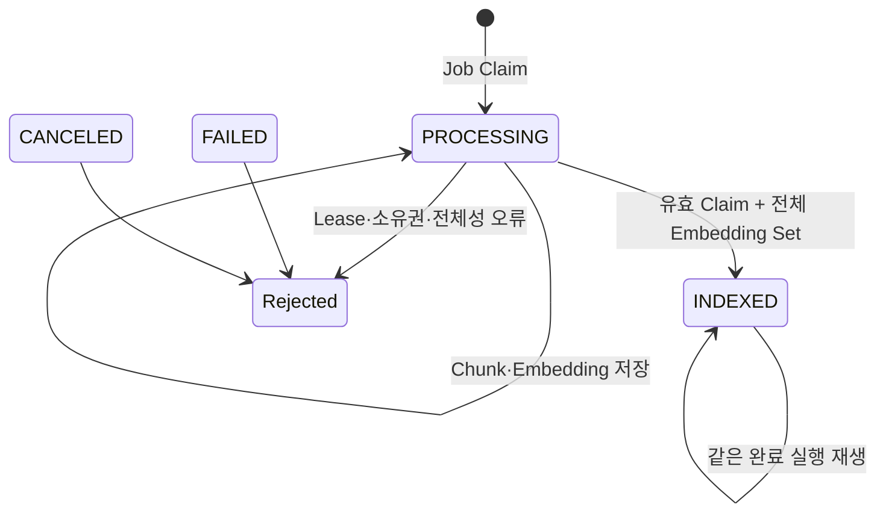
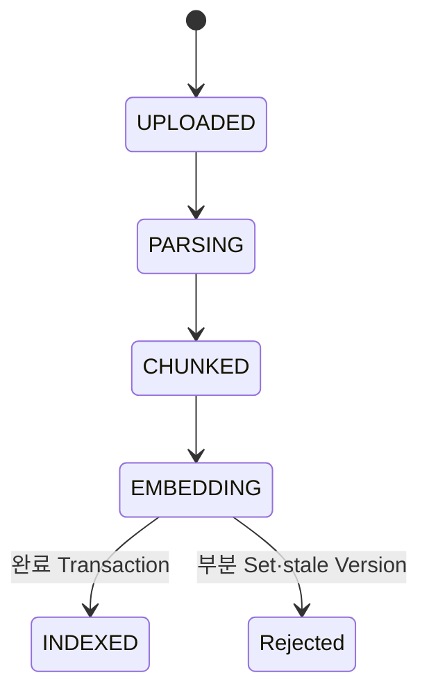
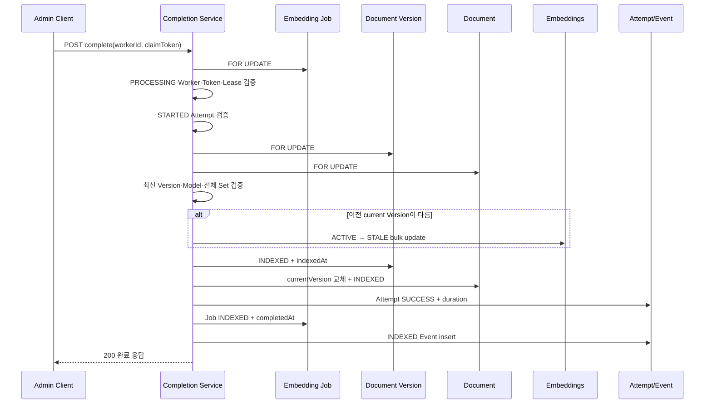
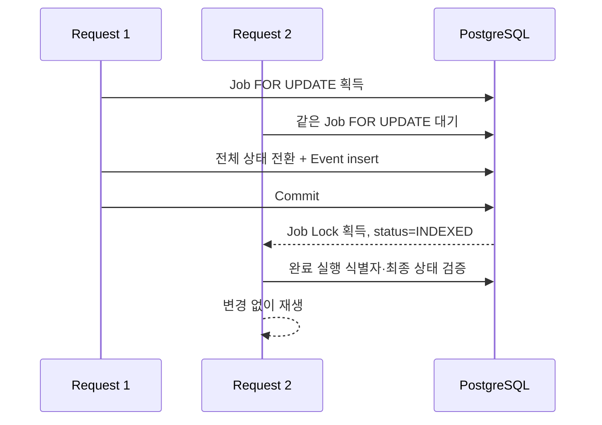

# 문서 인덱싱 완료 및 검색 가능 Version 전환 설계

## 1. 문서 목적

이 문서는 이슈 [#84](https://github.com/DocGrid/backend/issues/84)의 구현 기준을 정의한다.

선행 기능은 문서 원본을 Chunk로 나누고, Job에 고정된 Embedding Model로 모든 Chunk의 Vector를
`embeddings`에 원자 저장한다. 하지만 Vector 저장만으로는 문서가 검색 대상이 되지 않는다.
현재 검색 Query는 다음 세 조건을 모두 요구하기 때문이다.

```text
documents.status = INDEXED
documents.current_version_id = embeddings.document_version_id
embeddings.status = ACTIVE
```

이번 기능은 전체 Embedding Set이 저장된 실행을 최종 완료하고 새 Version을 검색 가능하게 만든다.
Attempt, Job, Version, Document, current Version 포인터, 이전 Version의 Embedding 상태와 완료 이벤트를
하나의 짧은 DB Transaction에서 함께 변경한다.

### 1.1 성공 기준

- 유효한 현재 Claim만 최초 완료를 수행한다.
- 대상 Version은 해당 Document의 최신 Version이며 전체 ACTIVE Embedding Set을 가진다.
- Attempt, Job, Version, Document와 Embedding 가시성이 한 Transaction으로 전환된다.
- 최초 문서는 완료 Transaction 커밋 전에는 검색되지 않고 커밋 후 검색된다.
- 새 Version 처리 중에는 기존 current Version이 검색되고 완료 후에는 새 Version만 검색된다.
- 같은 완료 요청의 순차·동시 재전송은 추가 상태 변경과 중복 이벤트를 만들지 않는다.
- 이미 성공한 같은 실행은 Lease가 만료된 뒤에도 완료 결과를 재생할 수 있다.
- 오래된 Worker, 다른 Token, 다른 Attempt와 stale Version은 검색 가시성을 바꾸지 못한다.

### 1.2 제외 범위

- Attempt·Job·Version 실패 종료와 오류 원인 저장
- 자동 재시도, Retry 횟수 증가와 다음 실행 시각 계산
- Lease 연장, 만료 Job 회수와 Worker Polling
- 과거 Version 수동 재활성화
- 부분 Embedding Set 복구·삭제 도구
- Batch·병렬 Embedding과 Checkpoint
- Embedding Model 교체·기존 문서 재색인
- 다중 searchable Model 지원
- Message Broker, Cache와 새 Production Dependency
- Flyway Migration

---

## 2. 현재 기준선

### 2.1 선행 파이프라인

현재 관리자 파이프라인은 다음 단계까지 구현돼 있다.

```text
PENDING Job Claim
    ↓
Attempt STARTED
    ↓
원본 읽기·Chunk 저장
    ↓
Chunk Embedding 생성·전체 Set 저장
    ↓
Version = EMBEDDING
Job = PROCESSING
Attempt = STARTED
Embedding = ACTIVE
```

`DocumentEmbeddingTransactionService`는 외부 HTTP 호출 전후로 Job과 Version을 같은 순서로 잠그고,
현재 Worker·Claim Token·Lease·Attempt를 재검증한다. 모든 Vector를 준비한 뒤 하나의 Transaction으로
전체 Embedding Set을 저장하므로 정상 경로에서는 부분 Set이 남지 않는다.

이번 완료 기능은 외부 I/O가 없다. 따라서 별도의 준비·외부 작업·완료 분리는 필요하지 않고,
한 개의 짧은 Command Transaction으로 구현한다.

### 2.2 최초 Version과 후속 Version의 차이

최초 업로드와 새 Version 업로드는 `current_version_id` 계약이 다르다.

| 구분 | 완료 전 Document 상태 | 완료 전 current Version | 완료 동작 |
|---|---|---|---|
| 최초 Version | `UPLOADED` | 미완료 대상 Version 자신 | 포인터 유지, 대상 Embedding 유지 |
| 새 Version | `INDEXED` | 기존 검색 가능 Version | 이전 Embedding `STALE`, 포인터 교체 |
| 실패 후 새 Version | `UPLOADED` | 과거 실패 또는 기존 Version | 기존 ACTIVE Embedding만 `STALE`, 포인터 교체 |

최초 업로드는 순환 FK 때문에 Document와 Version을 차례로 Insert한 뒤 미완료 Version을
`current_version_id`로 설정한다. 이때 Document가 `INDEXED`가 아니므로 검색 Query가 노출을 막는다.

새 Version 업로드는 새 Version이 완료될 때까지 기존 `INDEXED` current Version을 유지한다.
따라서 완료 Transaction은 최초 Version에서 자기 Embedding을 `STALE`로 만들지 않아야 하고,
후속 Version에서만 이전 current Version의 ACTIVE Embedding을 비활성화해야 한다.

### 2.3 검색 가시성의 이중 방어

`VectorSearchRepository`는 다음 조건을 함께 적용한다.

```sql
e.status = 'ACTIVE'
AND d.status = 'INDEXED'
AND d.current_version_id = e.document_version_id
```

`current_version_id`만 바꿔도 이전 Version은 검색되지 않지만 Embedding의 `STALE` 전환을 함께 수행한다.
두 조건을 같이 유지하는 이유는 다음과 같다.

- current Version 포인터는 어떤 Version이 논리적으로 활성인지 표현한다.
- Embedding 상태는 해당 Vector Set이 검색 후보인지 표현한다.
- Query의 방어 조건이 하나 누락돼도 구버전 Vector 혼입을 줄인다.
- 운영 조회에서 ACTIVE이지만 current가 아닌 오래된 Set을 정상으로 오해하지 않는다.

---

## 3. 핵심 설계 결정

### 3.1 완료는 하나의 짧은 Transaction이다

완료 과정에는 외부 HTTP, Object Storage와 긴 계산이 없다. 모든 검증과 상태 변경을 하나의
`@Transactional` Command Service에서 수행한다.

```mermaid
flowchart LR
    A["관리자 완료 API"] --> B["DocumentIndexingCompletionService"]
    B --> C["Job 잠금·실행 Context 판정"]
    C --> D["Version 잠금"]
    D --> E["Document 잠금"]
    E --> F["Chunk·Embedding 전체성 검증"]
    F --> G["이전 Embedding STALE"]
    G --> H["Attempt·Job·Version·Document 완료"]
    H --> I["INDEXED 이벤트 저장"]
    I --> J["한 번에 Commit"]
```



검증 실패나 상태 변경 중 예외가 발생하면 Transaction 전체가 Rollback된다. 중간 상태를 별도
보상 Transaction으로 복구하지 않는다.

### 3.2 잠금 순서는 Job → Version → Document다

모든 최초 완료와 완료 재생은 다음 순서로 행을 잠근다.

```text
1. embedding_jobs
2. document_versions
3. documents
```

이 순서의 의미는 다음과 같다.

- Job 잠금이 Claim 교체, Attempt 변경과 같은 Job의 동시 완료를 직렬화한다.
- Version 잠금이 Embedding 저장 완료와 최종 Version 전이를 직렬화한다.
- Document 잠금이 `current_version_id` 교체와 새 Version 업로드를 직렬화한다.

`DocumentVersionUploadService`는 Document만 먼저 잠그지만 기존 Job이나 Version의 쓰기 잠금을
추가로 획득하지 않는다. 완료 흐름은 Job과 Version을 잠근 뒤 Document를 기다릴 수 있으나,
업로드 흐름이 반대 방향으로 같은 Job·Version 잠금을 기다리지 않으므로 현재 구조에는 순환 대기가 없다.

향후 실패·복구 기능이 Job, Version과 Document를 함께 변경하면 반드시 같은 순서를 사용해야 한다.
Document를 먼저 잠근 뒤 기존 Job이나 Version을 잠그는 새 흐름은 추가하지 않는다.

### 3.3 최초 완료와 완료 재생의 검증 규칙을 분리한다

Job 잠금 뒤 상태로 요청을 분기한다.

| Job 상태 | 처리 |
|---|---|
| `PROCESSING` | 현재 소유권과 Lease를 검증하고 최초 완료 수행 |
| `INDEXED` | 저장된 완료 실행 식별자를 검증하고 읽기 전용 재생 |
| `PENDING`, `FAILED`, `CANCELED` | 완료 불가 `409` |

최초 완료는 아직 상태를 바꾸는 권한을 확인해야 하므로 `EmbeddingJobOwnershipValidator`를 사용한다.
따라서 요청 시각에 Lease가 유효해야 한다.

완료 재생은 이미 커밋된 결과를 확인하는 작업이다. 응답 유실 뒤 재요청이 Lease 만료 때문에 실패하면
완료 API의 멱등성이 깨진다. 재생에서는 Lease를 검사하지 않고 다음 저장값을 모두 비교한다.

- Job ID와 상태 `INDEXED`
- Job의 Worker ID와 Claim Token
- Path Attempt ID
- Attempt의 Job, Worker와 Claim Token
- Attempt 상태 `SUCCESS`
- Job `completed_at`, Attempt `ended_at`, `duration_ms`
- Version 상태 `INDEXED`, `indexed_at`
- Job의 `INDEXED` 이벤트 정확히 한 건

다른 Worker나 Token이 완료 결과를 가장하는 것은 재생에서도 `409`로 거부한다.

### 3.4 완료 응답은 이후 Version 교체에도 안정적인 값만 담는다

완료된 과거 Job은 더 최신 Version이 활성화된 뒤에도 재생될 수 있다.
따라서 응답에 호출 시점의 `currentVersionId`, 현재 Document 상태, 현재 Embedding 상태를 넣으면
같은 완료 실행의 응답이 이후 작업에 따라 달라진다.

응답에는 완료 실행에 귀속돼 이후에도 변하지 않는 값만 포함한다.

- Job ID
- Attempt ID
- Document ID
- 완료한 Document Version ID
- Job 고정 Embedding Model ID
- Job 상태 `INDEXED`
- Attempt 상태 `SUCCESS`
- Version 상태 `INDEXED`
- 완료 시각
- Attempt 처리 시간

최신 Document 상태와 current Version은 기존 문서 상태 조회 API가 담당한다.

### 3.5 Job 고정 Model이 완료 시점에도 검색 Model이어야 한다

문서 Vector는 Job 생성 시점의 Model로 고정한다. Query Embedding은 호출 시점의 유일한
`active + searchable` Model을 사용한다.

Job 처리 중 Model이 바뀌었는데 과거 Model의 Version을 `INDEXED`로 활성화하면 Document는 상태상
검색 가능하지만 Query와 같은 Vector 공간을 사용하지 않아 실제 검색 결과가 나오지 않는다.

MVP에서는 완료 시 다음 조건을 검증한다.

```text
job.embeddingModel.id is not null
job.embeddingModel.isActive = true
job.embeddingModel.isSearchable = true
job.embeddingModel.dimension > 0
```

완료된 Job의 재생에서는 이후 Model 설정 변경을 이유로 과거 성공 기록을 거부하지 않는다.
Model 교체와 기존 Document 재색인은 별도 기능으로 다룬다.

---

## 4. 상태 전이

### 4.1 최초 완료 전후

| 대상 | 완료 전 | 완료 후 |
|---|---|---|
| Attempt | `STARTED` | `SUCCESS`, endedAt·durationMs 기록 |
| Job | `PROCESSING` | `INDEXED`, completedAt 기록 |
| 대상 Version | `EMBEDDING` | `INDEXED`, indexedAt 기록 |
| Document | `UPLOADED` 또는 `INDEXED` | `INDEXED` |
| current Version | 대상 자신 또는 더 오래된 Version | 대상 Version |
| 대상 Embedding | 전부 `ACTIVE` | 전부 `ACTIVE` |
| 이전 current Embedding | `ACTIVE` 가능 | 대상과 다를 때 `STALE` |
| 이벤트 | `INDEXED` 없음 | `INDEXED` 한 건 |

Attempt, Job, Version과 이벤트는 같은 `completedAt`을 사용한다.

```text
durationMs = completedAt - attempt.startedAt
```

`startedAt`이 없거나 완료 시각보다 미래면 내부 데이터 불일치로 처리한다. 음수를 0으로 보정해
데이터 문제를 숨기지 않는다.

### 4.2 완료 재생

재생에서는 어떤 Entity나 Embedding도 수정하지 않는다.

```text
Job INDEXED
Attempt SUCCESS
Version INDEXED
INDEXED Event 1
    ↓
저장된 completedAt·durationMs로 동일 완료 응답 반환
```

더 최신 Version이 이미 활성화돼 과거 Version의 Embedding이 `STALE`이어도 과거 완료는 유효하다.
재생 검증은 대상 Version이 현재 Version인지, 대상 Embedding이 아직 ACTIVE인지 요구하지 않는다.

### 4.3 상태 머신





---

## 5. API 계약

### 5.1 Endpoint

```http
POST /admin/indexing-jobs/{jobId}/attempts/{attemptId}/complete
Content-Type: application/json
Authorization: Bearer {ADMIN_TOKEN}
```

기존 `/admin/**` Security 정책을 재사용한다.

### 5.2 요청

```json
{
  "workerId": 7,
  "claimToken": "34c19d16-6ae1-4f6a-a35d-0123456789ab"
}
```

`CompleteDocumentIndexingRequest`를 새로 만든다.

| 필드 | 검증 |
|---|---|
| `workerId` | null 불가, 양수 |
| `claimToken` | null·공백 불가, canonical 소문자 UUID |

Claim Token 형식은 선행 Attempt·Chunk·Embedding 요청과 같은 검증 계약을 사용한다.

### 5.3 성공 응답

최초 완료와 멱등 재생은 모두 `200 OK`다.

```json
{
  "success": true,
  "data": {
    "jobId": 41,
    "attemptId": 103,
    "documentId": 10,
    "documentVersionId": 22,
    "embeddingModelId": 1,
    "jobStatus": "INDEXED",
    "attemptStatus": "SUCCESS",
    "versionStatus": "INDEXED",
    "completedAt": "2026-07-31T16:00:00",
    "durationMs": 8421
  }
}
```

`DocumentIndexingCompletionResponse`는 Claim Token, Worker 내부 상태, Chunk 본문, Vector,
Vector Hash와 이전 Version ID를 반환하지 않는다.

### 5.4 HTTP 오류

| HTTP | 조건 |
|---|---|
| `400` | Path ID, Worker ID, Claim Token 형식 오류 |
| `403` | ADMIN 권한 없음 또는 미인증 |
| `404` | Embedding Job 없음 |
| `409` | Job 상태, 소유권, Lease, Attempt, stale Version, 완료 불가 상태 |
| `500` | Job·Attempt·Version·Document·Embedding·이벤트 데이터 불일치 |

---

## 6. 완료 Transaction 상세 흐름

### 6.1 전체 알고리즘

```text
1. Job을 FOR UPDATE로 조회한다.
2. Job 상태가 INDEXED면 완료 재생으로 분기한다.
3. Job 상태가 PROCESSING이 아니면 거부한다.
4. 잠금 획득 뒤 계산한 현재 시각으로 Worker·Token·Lease를 검증한다.
5. 같은 Job·Token의 Attempt를 조회하고 Path ID·Worker·STARTED 상태를 검증한다.
6. Job이 가리키는 Version을 FOR UPDATE로 조회한다.
7. Version이 가리키는 Document를 FOR UPDATE로 조회한다.
8. Version·Document 관계, 최신 Version과 current Version 포인터를 검증한다.
9. Job Model과 Version 상태를 검증한다.
10. Chunk·Embedding 전체 Set과 INDEXED 이벤트 사전 상태를 검증한다.
11. 이전 current Version이 대상과 다르면 ACTIVE Embedding을 STALE로 일괄 갱신한다.
12. Version, Document, Attempt와 Job을 완료 상태로 전환한다.
13. INDEXED 이벤트를 저장한다.
14. Transaction Commit 뒤 완료 응답을 반환한다.
```

모든 검증은 최초 상태 변경 전에 끝낸다. 검증 도중 일부 Entity 상태를 먼저 바꾸지 않는다.

### 6.2 정상 완료 Sequence



### 6.3 동시 완료 Sequence



두 번째 요청이 Job 잠금을 얻었을 때 Lease가 만료됐더라도 첫 요청의 완료가 커밋됐다면 재생할 수 있다.
반대로 첫 요청이 Rollback돼 Job이 계속 `PROCESSING`이면 두 번째 요청은 현재 시각의 Lease 검증을
통과해야 최초 완료를 수행할 수 있다.

---

## 7. 최초 완료 검증 규칙

### 7.1 Job

- ID가 존재한다.
- 상태가 `PROCESSING`이다.
- `lockedByWorker`, `claimToken`, `lockedAt`, `lockExpiresAt`이 모두 존재한다.
- 요청 Worker와 Token이 저장값과 같다.
- `lockExpiresAt`은 Job 잠금 뒤 계산한 `completedAt`보다 뒤다.
- `documentVersion`과 `embeddingModel` 연관 ID가 존재한다.
- 대상 Version의 `PENDING`·`PROCESSING` Job은 현재 Job 하나뿐이다.

마지막 조건은 잘못된 직접 데이터 입력이나 과거 버그로 동일 Version에 활성 Job이 둘 생긴 경우
두 완료 흐름이 각각 상태를 확정하는 것을 막는다.

### 7.2 Attempt

- Job ID와 Claim Token으로 조회된다.
- Path Attempt ID와 같다.
- Attempt의 Job ID가 잠근 Job과 같다.
- Worker ID가 요청 및 Job Worker와 같다.
- 상태가 `STARTED`다.
- `startedAt`이 존재하고 `completedAt` 이후가 아니다.

Attempt는 별도 Pessimistic Lock을 추가하지 않는다. 모든 Attempt 상태 변경이 Job 잠금을 먼저
획득한다는 규칙으로 같은 Job의 변경을 직렬화한다.

### 7.3 Version과 Document

- Job이 직접 참조하는 Version을 사용한다.
- Version 상태가 `EMBEDDING`이다.
- Version의 Document ID가 존재한다.
- Version이 가리키는 Document를 잠금 조회한다.
- Document가 `DELETED` 또는 `ARCHIVED`가 아니다.
- Document 상태가 `UPLOADED`, `INDEXING`, `INDEXED` 중 하나다.
- current Version이 존재하고 같은 Document 소속이다.
- current Version 번호가 완료 대상 Version 번호보다 크지 않다.
- Document 잠금 뒤 조회한 최신 Version ID가 완료 대상 Version ID와 같다.

대상보다 최신 Version이 이미 존재하면 stale 완료 `409`로 처리한다. 관계 필드가 서로 다른
Document를 가리키면 내부 데이터 불일치 `500`이다.

### 7.4 Model

- Job Model ID가 존재한다.
- Dimension이 양수다.
- `isActive`와 `isSearchable`이 모두 true다.
- 완료 대상 모든 Embedding의 Model ID와 Dimension이 Job Model과 같다.

### 7.5 Chunk와 Embedding

다음 개수를 한 번에 비교한다.

```text
chunkCount > 0
allEmbeddingsForVersion = chunkCount
jobModelEmbeddingsForVersion = chunkCount
activeJobModelEmbeddingsForVersion = chunkCount
inconsistentEmbeddingRows = 0
```

`inconsistentEmbeddingRows`는 Vector 본문을 JVM으로 읽지 않는 집계 Query로 검증한다.

- Embedding의 `document_id`가 대상 Document와 다름
- Embedding의 `document_version_id`가 대상 Version과 다름
- Embedding의 Chunk가 대상 Version 소속이 아님
- Embedding의 Model이 Job Model과 다름
- 저장 Dimension 또는 실제 `vector_dims(vector)`가 Model Dimension과 다름
- Vector Hash가 null이거나 64자리 소문자 SHA-256 Hex가 아님

`(chunk_id, embedding_model_id)` Unique Constraint와 위 개수·연관 검증을 결합하면 각 Chunk가
Job Model의 ACTIVE Embedding을 정확히 하나 가진다는 결론을 얻을 수 있다.

### 7.6 이벤트 사전 상태

최초 완료 전 현재 Job의 `INDEXED` 이벤트 수는 0이어야 한다. 이미 이벤트가 있는데 Job이
`PROCESSING`이면 상태와 이력 로그가 모순이므로 새 이벤트를 추가하지 않고 내부 오류로 거부한다.

---

## 8. current Version 교체와 STALE 처리

### 8.1 최초 Version

```text
document.currentVersion.id == targetVersion.id
```

이 경우 이전 Version 비활성화 Query를 실행하지 않는다. 대상 Embedding은 ACTIVE를 유지하고,
Version과 Document 상태만 `INDEXED`로 바뀐다.

### 8.2 새 Version

```text
document.currentVersion.id != targetVersion.id
```

다음 순서로 변경한다.

```text
1. previousCurrentVersion의 ACTIVE Embedding을 STALE로 bulk update
2. targetVersion을 INDEXED로 전환
3. document.currentVersion을 targetVersion으로 교체
4. document를 INDEXED로 전환
```

SQL 실행 순서는 존재하지만 다른 Transaction은 Commit 전 중간 결과를 볼 수 없다.
검색 요청은 Commit 전에는 기존 current Version과 ACTIVE Embedding을 보고, Commit 후에는 새
current Version과 새 ACTIVE Embedding을 본다.

### 8.3 과거 Version 자체는 INDEXED를 유지한다

이전 Version의 상태를 `FAILED`나 별도 상태로 바꾸지 않는다. Version은 과거 한 시점에 성공적으로
색인됐다는 이력과 Citation 관계를 보존한다.

검색 제외는 다음 두 값으로 표현한다.

- Document의 current Version이 더 최신 Version으로 이동
- 과거 Version의 Embedding이 `STALE`

---

## 9. 완료 재생 규칙

### 9.1 재생이 허용되는 조건

Job이 `INDEXED`일 때 다음 조건을 모두 만족해야 한다.

- Job Worker와 요청 Worker가 같다.
- Job Claim Token과 요청 Token이 같다.
- Attempt ID가 Path와 같다.
- Attempt Job·Worker·Token이 Job 및 요청과 같다.
- Attempt 상태가 `SUCCESS`다.
- Job completedAt, Attempt endedAt·durationMs가 존재한다.
- Version 상태가 `INDEXED`이고 indexedAt이 존재한다.
- Job의 `INDEXED` 이벤트가 정확히 한 건이다.

Lease, latest Version, current Version과 Embedding ACTIVE 상태는 재생 조건이 아니다.

### 9.2 재생에서 금지되는 변경

- Attempt endedAt·durationMs 재계산
- Job completedAt 덮어쓰기
- Version indexedAt 덮어쓰기
- Document current Version 교체
- Embedding ACTIVE·STALE 변경
- INDEXED 이벤트 추가

응답은 저장된 최초 완료 시각과 처리 시간을 사용한다.

### 9.3 재생이 Lease를 무시하는 이유

Lease는 아직 끝나지 않은 작업의 상태 변경 권한을 제한한다. 이미 성공한 결과를 읽는 데까지 Lease를
요구하면 다음 상황에서 클라이언트가 성공 여부를 확인할 수 없다.

```text
서버: 완료 Commit 성공
네트워크: 응답 유실
시간: Lease 만료
클라이언트: 같은 Token으로 결과 재요청
```

재생은 새 상태를 만들지 않으며 ADMIN API와 저장된 Claim Token 비교로 보호된다.

---

## 10. Domain 변경

### 10.1 EmbeddingJob

`markIndexed`는 `PROCESSING`에서만 호출할 수 있도록 Guard를 추가한다.

```text
PROCESSING → INDEXED 허용
그 외 → IllegalStateException
```

completedAt을 함께 기록한다. 기존 Worker, Claim Token과 Lease 필드는 완료 실행 식별 및 감사 근거로
유지하고 API에는 노출하지 않는다.

### 10.2 EmbeddingJobAttempt

`markSuccess`는 `STARTED`에서만 허용한다.

- 상태를 `SUCCESS`로 변경
- endedAt 기록
- durationMs 기록
- errorCode와 errorMessage는 설정하지 않음

재생은 이 메서드를 다시 호출하지 않는다.

### 10.3 DocumentVersion

`markIndexed`는 `EMBEDDING`에서만 허용한다.

- 상태를 `INDEXED`로 변경
- indexedAt 기록

과거에 이미 `INDEXED`인 Version의 재생은 메서드를 다시 호출하지 않는다.

### 10.4 Document

완료 전용 메서드 `activateIndexedVersion`을 추가한다.

```text
입력 Version이 이 Document 소속인지 검증
입력 Version 상태가 INDEXED인지 검증
currentVersion = 입력 Version
status = INDEXED
```

초기 업로드에서 미완료 Version 포인터를 설정하는 `updateCurrentVersion`은 기존 용도를 유지한다.

---

## 11. Repository 변경

### 11.1 EmbeddingRepository

추가 계약은 다음과 같다.

```java
long countByDocumentVersionId(Long versionId);

long countByDocumentVersionIdAndEmbeddingModelIdAndStatus(
    Long versionId,
    Long modelId,
    EmbeddingStatus status
);

int markActiveAsStaleByDocumentVersionId(Long versionId);

long countInvalidCompletionRows(
    Long documentId,
    Long versionId,
    Long modelId,
    int dimension
);
```

`markActiveAsStaleByDocumentVersionId`는 `@Modifying` bulk update를 사용한다. 완료 Service는 이전
Version Embedding Entity를 영속성 Context에 올리지 않으므로 bulk update와 관리 Entity 값이
충돌하지 않는다.

`countInvalidCompletionRows`는 OpenSQL/pgvector Native Query로 구현해 Vector 배열을 JVM으로
전송하지 않고 연관·Dimension·Hash만 집계한다.

### 11.2 EmbeddingJobRepository

동일 Version의 활성 Job이 하나인지 검증할 수 있는 개수 조회를 추가한다.

```java
long countByDocumentVersionIdAndStatusIn(
    Long versionId,
    Collection<EmbeddingJobStatus> statuses
);
```

활성 상태는 `PENDING`, `PROCESSING`이다. 최초 완료 시 현재 `PROCESSING` Job 한 건만 있어야 한다.

### 11.3 IndexingEventRepository

완료 이벤트의 사전 상태와 재생 정합성을 검증한다.

```java
long countByEmbeddingJobIdAndEventType(
    Long jobId,
    IndexingEventType eventType
);
```

### 11.4 DocumentVersionRepository

기존 `findTopByDocumentIdOrderByVersionNoDesc`를 Document 잠금 뒤 호출한다.
새 Version 업로드는 Document 잠금을 먼저 획득하므로 애플리케이션을 통한 동시 Insert는 최신 Version
검증과 경합한다.

별도 Version 목록 잠금이나 새 Migration은 추가하지 않는다.

---

## 12. Service 구조

### 12.1 DocumentIndexingCompletionService

경로:

```text
src/main/java/com/opensource/docgrid/domain/embedding/service/command/
└── DocumentIndexingCompletionService.java
```

책임:

- 완료 Transaction 시작과 종료
- Job → Version → Document 잠금 순서
- 최초 완료와 재생 분기
- 실행 Context·전체 Set·최신 Version 검증
- 이전 Embedding STALE 처리
- 상태 전이와 INDEXED 이벤트 저장
- 안정적인 완료 응답 생성

책임이 아닌 것:

- Claim 발급
- Attempt 생성
- Chunk·Vector 생성
- 실패·Retry 처리
- 외부 호출
- 일반 사용자 문서 상태 조회

별도 Facade는 만들지 않는다. 외부 I/O가 없고 Transaction이 하나이므로 Controller가 Command Service를
직접 호출한다.

### 12.2 내부 메서드 분리

한 번만 쓰이는 범용 추상화는 만들지 않고 검증 의도가 보이는 private 메서드로 나눈다.

```text
complete
├── findLockedJob
├── resolveAttempt
├── completeProcessingJob
│   ├── validateOwnership
│   ├── findLockedVersionAndDocument
│   ├── validateLatestTarget
│   ├── validateEmbeddingSet
│   ├── stalePreviousEmbeddings
│   └── transitionAndRecordEvent
└── replayIndexedJob
    ├── validateCompletedIdentity
    └── validateCompletedState
```

Service의 순차 실행 지점에는 `1.`, `2.`, `3.` 형태의 번호 주석을 사용한다.

---

## 13. 이벤트 계약

최초 완료에서 다음 이벤트를 한 건 저장한다.

| 필드 | 값 |
|---|---|
| `eventType` | `INDEXED` |
| `fromStatus` | `EMBEDDING` |
| `toStatus` | `INDEXED` |
| `message` | `Document Version 인덱싱을 완료했습니다.` |
| `metadataJson` | null |
| `occurredAt` | completedAt |

Claim Token, Worker 내부 정보, Chunk 본문, Vector, Vector Hash와 File Object 위치는 이벤트에 넣지 않는다.

재생은 이벤트를 추가하지 않고 기존 이벤트가 정확히 한 건인지 검증한다.

---

## 14. 오류 계약

기존 오류를 우선 재사용한다.

| ErrorCode | 사용 조건 |
|---|---|
| `EMBEDDING_JOB_NOT_FOUND` | Job 없음 |
| `EMBEDDING_JOB_OWNERSHIP_INVALID` | Worker·Token 불일치 |
| `EMBEDDING_JOB_LEASE_EXPIRED` | 최초 완료 시 Lease 만료 |
| `EMBEDDING_JOB_OWNERSHIP_INCONSISTENT` | PROCESSING Job 소유권 필드 모순 |
| `EMBEDDING_JOB_ATTEMPT_INVALID` | Attempt ID·Worker·Token·상태 불일치 |
| `EMBEDDING_MODEL_NOT_CONFIGURED` | Job Model이 완료 시점에 active·searchable이 아님 |

완료 기능 전용 오류를 추가한다.

| 신규 ErrorCode | HTTP | 조건 |
|---|---:|---|
| `DOCUMENT_INDEXING_COMPLETION_NOT_ALLOWED` | 409 | 허용되지 않은 Job·Version·Document 상태 |
| `DOCUMENT_INDEXING_STALE_COMPLETION` | 409 | 대상보다 최신 Version 존재 또는 current 포인터가 더 최신 |
| `DOCUMENT_INDEXING_COMPLETION_INCONSISTENT` | 500 | 연관·개수·Dimension·Hash·완료 시각·이벤트 모순 |

로그에는 Job ID, Attempt ID, Document ID, Version ID와 개수만 남긴다.
Claim Token, Chunk Text와 Vector 값은 기록하지 않는다.

---

## 15. 동시성과 교착 분석

### 15.1 같은 Job의 동시 완료

Job Pessimistic Lock으로 직렬화한다.

- 첫 요청: `PROCESSING`을 보고 최초 완료
- 두 번째 요청: Commit 뒤 `INDEXED`를 보고 재생
- INDEXED 이벤트: 한 건
- completedAt·durationMs: 첫 요청 값 유지

### 15.2 완료와 새 Version 업로드

새 Version 업로드는 Document를 먼저 잠근다.

가능한 순서는 두 가지다.

#### 업로드가 Document Lock을 먼저 얻음

```text
업로드: Document Lock
완료: Job → Version Lock 후 Document 대기
업로드: 처리 중 Version 확인 후 거부 또는 새 Version 생성 후 Commit
완료: Document Lock 획득 후 최신 Version 재검증
```

업로드가 더 최신 Version을 만들었다면 완료는 stale 완료로 거부한다.

#### 완료가 Document Lock을 먼저 얻음

```text
완료: Job → Version → Document Lock
업로드: Document Lock 대기
완료: current Version 교체 후 Commit
업로드: 새 current Version 기준으로 동일 파일·상태 검증
```

어느 순서에서도 두 Transaction이 서로 반대 방향의 같은 Lock을 기다리지 않는다.

### 15.3 다른 Version 완료 경쟁

부분 Unique Index는 한 Document에 `UPLOADED`, `PARSING`, `CHUNKED`, `EMBEDDING` Version을 하나만
허용한다. 직접 데이터 입력이나 미래 재처리 기능으로 두 완료 후보가 생겨도 Document Lock과 최신
Version 검증으로 하나만 current Version을 바꿀 수 있다.

### 15.4 검색 요청과 완료

검색은 행 잠금을 획득하지 않는다. PostgreSQL `READ COMMITTED`에서 검색 Statement는 완료
Transaction 커밋 전 또는 후의 일관된 Snapshot을 읽는다.

- 커밋 전: 기존 current Version + 기존 ACTIVE Embedding
- 커밋 후: 새 current Version + 새 ACTIVE Embedding

중간의 포인터만 바뀌고 Embedding이 아직 ACTIVE/STALE 전환되지 않은 상태는 다른 Transaction에
노출되지 않는다.

---

## 16. 보안과 운영 관점

### 16.1 민감 데이터 경계

다음 값은 API 응답, 이벤트와 일반 로그에 넣지 않는다.

- Claim Token
- Chunk 본문
- Embedding Vector
- Vector Hash
- MinIO Bucket·Object Key
- 내부 예외 Stack Trace의 요청 Body

Claim Token은 요청 검증과 저장값 비교에만 사용한다.

### 16.2 완료 후 Claim 정보 유지

Job과 Attempt의 Claim Token 및 Worker 연관은 완료 재생과 감사 근거로 유지한다.
Job 상태가 `INDEXED`이므로 새로운 실행 권한으로 사용할 수 없고 일반 사용자 API에 노출되지 않는다.

향후 보존 정책에서 Token 삭제가 필요하면 완료 결과용 별도 Idempotency Key 또는 완료 Receipt를
먼저 설계해야 한다.

### 16.3 관측 가능성

정상 완료 로그:

```text
jobId, attemptId, documentId, versionId, chunkCount, embeddingCount, durationMs
```

정상 재생 로그:

```text
jobId, attemptId, completedAt, replay=true
```

데이터 불일치 로그는 실제 개수와 식별자만 남기고 본문과 Vector는 남기지 않는다.

---

## 17. 파일별 변경 계획

### 17.1 신규 파일

```text
src/main/java/com/opensource/docgrid/domain/embedding/dto/request/
└── CompleteDocumentIndexingRequest.java

src/main/java/com/opensource/docgrid/domain/embedding/dto/response/
└── DocumentIndexingCompletionResponse.java

src/main/java/com/opensource/docgrid/domain/embedding/service/command/
└── DocumentIndexingCompletionService.java

src/test/java/com/opensource/docgrid/domain/embedding/service/command/
└── DocumentIndexingCompletionServiceTest.java

src/test/java/com/opensource/docgrid/domain/embedding/integration/
├── DocumentIndexingCompletionIntegrationTest.java
└── DocumentIndexingCompletionRollbackIntegrationTest.java
```

모든 신규 Class와 Record에는 역할·책임·경계를 설명하는 class-level comment를 작성한다.

### 17.2 수정 파일

```text
src/main/java/com/opensource/docgrid/domain/embedding/controller/
└── IndexingJobAdminController.java

src/main/java/com/opensource/docgrid/domain/embedding/entity/
└── EmbeddingJob.java

src/main/java/com/opensource/docgrid/domain/worker/entity/
└── EmbeddingJobAttempt.java

src/main/java/com/opensource/docgrid/domain/document/entity/
├── Document.java
└── DocumentVersion.java

src/main/java/com/opensource/docgrid/domain/embedding/repository/
├── EmbeddingJobRepository.java
└── EmbeddingRepository.java

src/main/java/com/opensource/docgrid/domain/worker/repository/
└── IndexingEventRepository.java

src/main/java/com/opensource/docgrid/global/exception/
└── ErrorCode.java
```

관련 Entity·Repository·Controller Test의 주석과 기존 전이 테스트를 새 Guard에 맞게 갱신한다.

### 17.3 변경하지 않는 파일

- Flyway Migration
- SecurityConfig의 `/admin/**` 정책
- EmbeddingClient와 외부 Server 설정
- VectorSearchRepository Query
- 일반 사용자 Document 상태 API 응답 계약
- Upload API와 File Storage

---

## 18. 테스트 설계

### 18.1 Entity 테스트

#### EmbeddingJob

- `PROCESSING → INDEXED` 성공과 completedAt 기록
- `PENDING`, `INDEXED`, `FAILED`, `CANCELED`에서 markIndexed 거부

#### EmbeddingJobAttempt

- `STARTED → SUCCESS`와 endedAt·durationMs 기록
- `SUCCESS`, `FAILED`에서 중복 markSuccess 거부

#### DocumentVersion

- `EMBEDDING → INDEXED`와 indexedAt 기록
- 다른 상태에서 markIndexed 거부

#### Document

- 같은 Document의 INDEXED Version 활성화
- 다른 Document Version과 미완료 Version 거부

### 18.2 Service 단위 테스트

정상:

- 최초 Version 완료
- 새 Version 완료와 이전 Embedding STALE
- 이미 INDEXED인 같은 실행 재생
- 재생은 Lease 만료 뒤에도 성공
- 완료 시각과 durationMs가 모든 응답에서 유지

소유권·Attempt:

- 다른 Worker
- 다른 Claim Token
- 다른 Attempt ID
- Attempt Worker 불일치
- Attempt `FAILED` 또는 이미 `SUCCESS`인데 Job은 PROCESSING
- 최초 완료 Lease 만료
- PROCESSING Job 소유권 필드 누락

상태·연관:

- Job이 PENDING·FAILED·CANCELED
- Version이 EMBEDDING이 아님
- Document가 DELETED·ARCHIVED
- Job Version과 잠근 Version 불일치
- Version과 Document 관계 불일치
- current Version이 다른 Document 소속
- 대상보다 최신 Version 존재

Model·전체 Set:

- Job Model ID 또는 Dimension 누락
- Job Model 비활성 또는 검색 불가
- Chunk 0건
- 부분 Embedding
- 다른 Model Embedding 혼입
- ACTIVE 수 불일치
- Dimension·Hash·역정규화 불일치
- 기존 INDEXED 이벤트 존재
- 동일 Version 활성 Job 중복

재생 불일치:

- INDEXED Job의 다른 Worker·Token·Attempt
- Attempt가 SUCCESS가 아님
- completedAt·endedAt·durationMs 누락
- Version이 INDEXED가 아님
- INDEXED 이벤트 0건 또는 2건 이상

### 18.3 Controller 테스트

- 유효한 ADMIN 완료 요청 `200`
- 완료 재생 `200`
- 잘못된 Job·Attempt ID `400`
- workerId null·0·음수 `400`
- Claim Token null·공백·비정규 UUID `400`
- USER 권한 `403`
- 미인증 `403`
- Service의 `404`, `409`, `500` ErrorResponse 매핑
- 응답에 Claim Token, Chunk, Vector 필드가 없음

### 18.4 OpenSQL 통합 테스트

#### 시나리오 A: 최초 Version 활성화

1. UPLOADED Document와 current Version을 생성한다.
2. Version·Job·Attempt·Chunk·ACTIVE Embedding Set을 완료 직전 상태로 준비한다.
3. 완료 API 또는 Service를 호출한다.
4. Attempt SUCCESS, Job·Version·Document INDEXED를 확인한다.
5. current Version이 대상 자신을 유지하는지 확인한다.
6. 대상 Embedding이 ACTIVE인지 확인한다.
7. INDEXED 이벤트 한 건과 동일 완료 시각을 확인한다.
8. 권한 pre-filter와 Vector Search에서 해당 Document가 검색되는지 확인한다.

#### 시나리오 B: 새 Version 교체

1. Version 1을 INDEXED current Version과 ACTIVE Embedding으로 준비한다.
2. Version 2를 EMBEDDING과 전체 ACTIVE Set으로 준비한다.
3. 완료 전 검색이 Version 1 Chunk만 반환하는지 확인한다.
4. Version 2 완료를 호출한다.
5. current Version이 Version 2로 바뀌는지 확인한다.
6. Version 1 Embedding은 STALE, Version 2는 ACTIVE인지 확인한다.
7. 완료 후 검색이 Version 2 Chunk만 반환하는지 확인한다.

#### 시나리오 C: 두 Thread 동시 완료

1. 같은 Job·Attempt·Worker·Token 요청 두 개를 준비한다.
2. 두 Thread를 Barrier로 동시에 시작한다.
3. 두 요청이 모두 같은 완료 응답으로 성공하는지 확인한다.
4. Job·Attempt·Version 완료 시각이 한 번만 결정됐는지 확인한다.
5. INDEXED 이벤트가 정확히 한 건인지 확인한다.
6. current Version과 Embedding 상태가 단일 결과로 수렴하는지 확인한다.

#### 시나리오 D: 완료 중 실패 Rollback

별도 Test Context에서 `IndexingEventRepository`를 실패 Stub으로 교체한다.

1. 실제 OpenSQL에 완료 직전 전체 데이터를 준비한다.
2. 모든 Entity와 이전 Embedding 상태 변경 뒤 이벤트 저장에서 예외를 발생시킨다.
3. 새 Transaction으로 DB를 다시 조회한다.
4. Attempt STARTED, Job PROCESSING, Version EMBEDDING을 확인한다.
5. Document current Version과 이전 ACTIVE Embedding이 그대로인지 확인한다.
6. INDEXED 이벤트가 0건인지 확인한다.

이 테스트는 Mockito만 사용하는 단위 테스트가 아니라 실제 Transaction Rollback을 DB 재조회로 검증한다.

### 18.5 전체 회귀

```bash
./gradlew clean build
git diff --check
```

OpenSQL 통합 테스트는 실제 `vector(1024)` Schema와 `vector_dims` 함수를 사용하는 환경에서 실행한다.

---

## 19. 구현 순서

1. Entity 성공 전이 Guard와 단위 테스트
2. Repository 개수·불일치·STALE·이벤트 조회 계약과 테스트
3. 완료 Request·Response 계약
4. `DocumentIndexingCompletionService` 최초 완료 경로
5. 완료 재생 경로와 멱등성 테스트
6. 관리자 Controller와 Security 계약 테스트
7. OpenSQL 최초·새 Version 검색 가시성 테스트
8. 동시 완료와 Rollback 통합 테스트
9. 전체 회귀와 설계·구현 정합성 갱신

각 단계는 기능 코드와 해당 계약 테스트가 함께 검증되도록 나눈다.

---

## 20. 선택지와 Trade-off

### 20.1 완료 전용 Receipt 테이블을 만들지 않는다

별도 Receipt는 완료 응답을 영구 Snapshot으로 저장할 수 있지만 Migration과 새 데이터 수명주기가 필요하다.
현재 Job·Attempt·Version에 안정적인 완료 시각과 실행 식별 정보가 있으므로 이를 재생 근거로 사용한다.

### 20.2 완료 재생에서 Lease를 검사하지 않는다

Lease를 검사하면 단순하지만 응답 유실 뒤 완료 확인이 불가능해질 수 있다. 재생은 상태를 바꾸지 않고
ADMIN 및 저장된 실행 식별자를 모두 검증하므로 Lease 없이 허용한다.

### 20.3 이전 Embedding을 삭제하지 않는다

삭제하면 저장 공간은 줄지만 과거 Citation과 운영 분석 근거가 사라진다. `STALE`로 전환해 검색에서
제외하면서 이력을 유지한다.

### 20.4 Version 전체 Vector를 다시 읽지 않는다

완료 시 Vector 전체를 JVM으로 읽고 Hash를 재계산하면 가장 강한 검증이 가능하지만 문서 크기에 비례한
메모리와 DB 전송 비용이 다시 발생한다. 생성 Transaction이 Vector와 Hash를 검증했으므로 완료에서는
DB 집계로 수·연관·상태·Dimension·Hash 형식을 검증한다.

### 20.5 current Version만 바꾸지 않고 Embedding도 STALE로 만든다

Query는 current Version 조건으로 구버전을 이미 차단한다. 그럼에도 상태를 함께 갱신해 검색 Query의
이중 방어와 운영 데이터 의미를 일치시킨다. 두 변경이 같은 Transaction이므로 중간 불일치는 노출되지 않는다.

---

## 21. 최종 완료 체크리스트

- [ ] Job → Version → Document 잠금 순서가 코드와 주석에 명시돼 있다.
- [ ] 최초 완료와 완료 재생이 Job 상태로 명확히 분리된다.
- [ ] 최초 완료는 현재 소유권·Lease·STARTED Attempt를 검증한다.
- [ ] 완료 재생은 같은 성공 실행만 허용하고 Lease를 요구하지 않는다.
- [ ] 대상은 최신 Version이고 Job Model이 active·searchable이다.
- [ ] Chunk와 ACTIVE Embedding 전체 Set이 정확히 일치한다.
- [ ] 최초 Version은 자기 Embedding을 STALE로 바꾸지 않는다.
- [ ] 새 Version은 이전 ACTIVE Embedding을 STALE로 바꾸고 current Version이 된다.
- [ ] Attempt·Job·Version·Document·Embedding·이벤트가 한 Transaction으로 커밋된다.
- [ ] 같은 완료 시각이 Attempt·Job·Version·이벤트에 사용된다.
- [ ] INDEXED 이벤트는 한 건만 생성된다.
- [ ] Claim Token, Chunk 본문과 Vector가 외부로 노출되지 않는다.
- [ ] 최초·새 Version의 실제 검색 가시성이 OpenSQL에서 검증된다.
- [ ] 동시 완료와 완료 중 실패 Rollback이 실제 DB에서 검증된다.
- [ ] 전체 빌드와 회귀 테스트가 통과한다.
