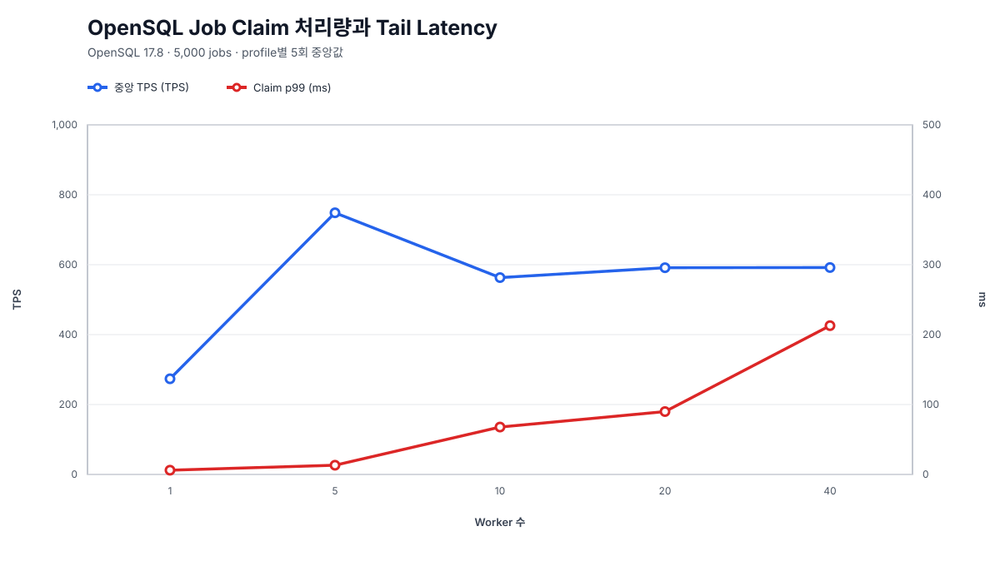
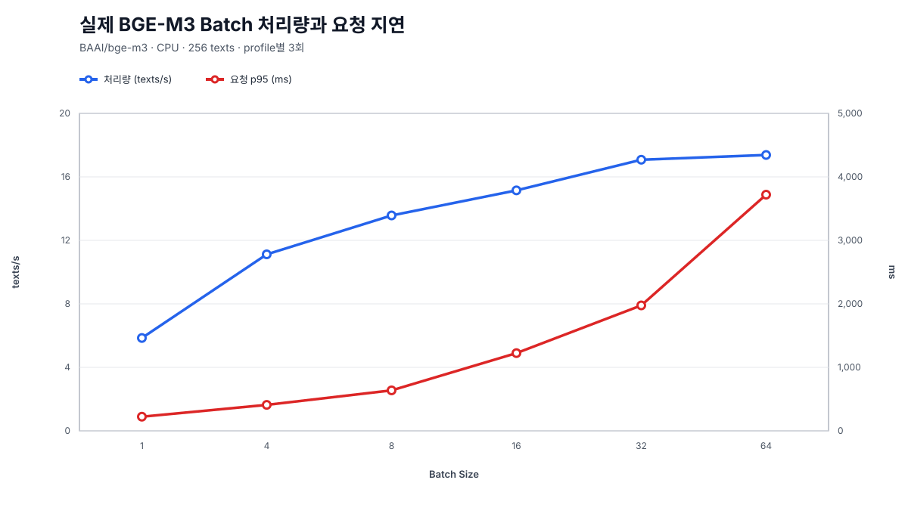
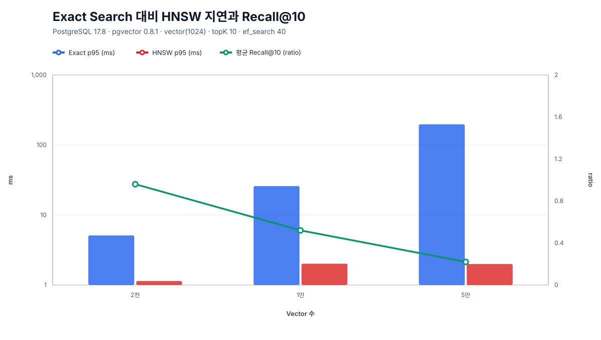
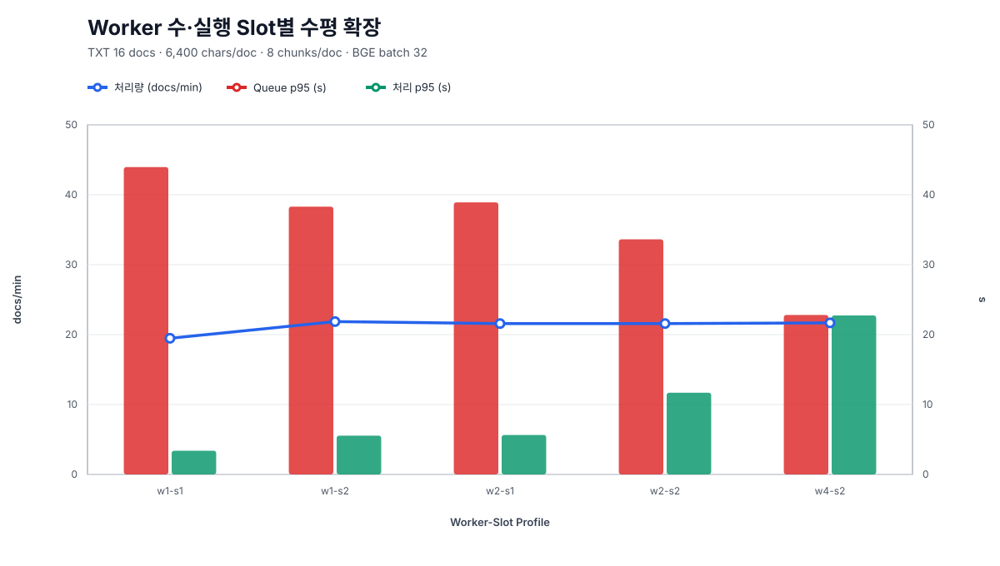
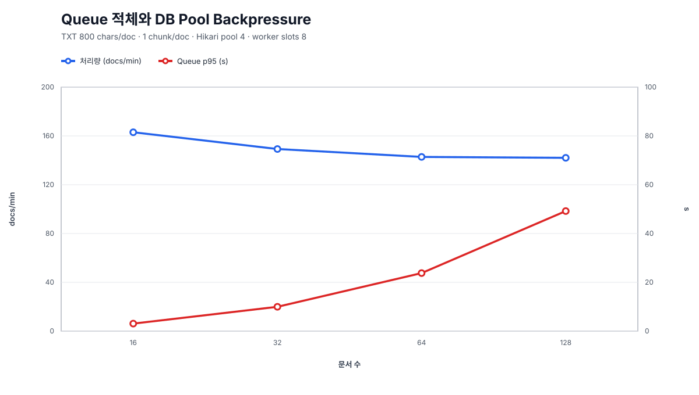
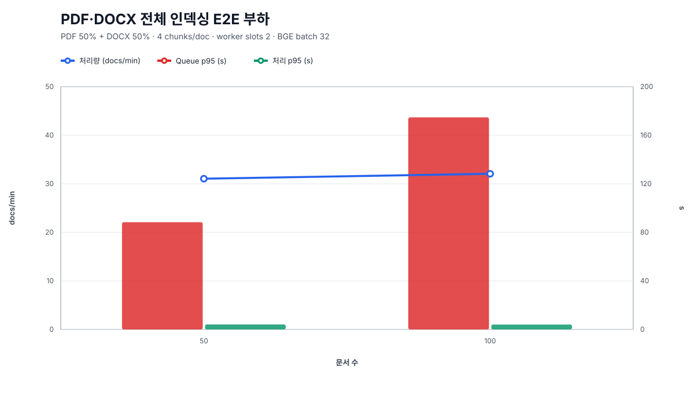

# DocGrid 인덱싱·Vector 검색 최종 통합 성능 리포트

- 관련 이슈: [#145](https://github.com/DocGrid/backend/issues/145)
- 기준 일자: 2026-08-11
- 데이터: [정규화 성능 원본](gimin-%23145-final-performance-report-data.json)
- 재현성 검사: `python3 scripts/performance/generate_final_performance_report.py --check`

## 1. Executive Summary

DocGrid의 핵심 인덱싱 경로를 Job Claim부터 실제 PDF·DOCX의 `vector(1024)` 저장까지 단계별로
측정했다. 한 장비에서 모든 수치를 하나의 처리량으로 합친 결과가 아니라, 각 단계의 고정 조건 안에서
병목과 선택 근거를 찾은 결과다.

| 단계 | 관측 결과 | 현재 판단 |
|---|---|---|
| Job Claim | OpenSQL 17.8에서 Worker 5가 748.45 TPS, p99 13.187ms로 처리량·Tail Latency 균형이 가장 좋음 | 검증 환경의 Claim 동시성 기준점은 5 |
| 실제 BGE-M3 | Batch 32가 최대 처리량의 98.27%이며 Batch 64보다 p95가 46.89% 낮음 | 기본 Batch 32 유지 |
| Vector 검색 | 5만 Vector에서 HNSW p95는 Exact보다 99.09배 빠르지만 평균 Recall@10은 0.22 | 실제 Corpus에서 `ef_search` 튜닝 전 품질 확정 금지 |
| Worker 확장 | 2 Slot부터 약 21.6문서/분으로 포화, 8 Slot 효율 0.139 | 단일 CPU BGE 환경에서는 2 Slot이 균형점 |
| Queue·DB Pool | 16문서부터 Pool Waiting, 64문서부터 약 142문서/분 Plateau, 128문서까지 붕괴 없음 | Queue depth·Oldest Pending Age 기반 운영 관측 필요 |
| PDF·DOCX E2E | 50·100문서에서 31.046·32.063문서/분, 본 측정 300문서·1,200 Vector 오류 0건 | 실제 문서 Pipeline 정합성과 처리량 기준선 확보 |

가장 중요한 결론은 Worker를 늘리면 무조건 빨라지지 않는다는 점이다. Claim 자체는 수백 TPS를
처리하지만 실제 전체 Pipeline에서는 CPU BGE-M3가 공유 병목이 된다. 실행 Slot을 늘리면 Job이 빨리
Claim되어 Queue 대기는 줄지만, Embedding 처리 대기가 늘어 E2E 시간과 처리량은 거의 개선되지 않았다.

## 2. 해석 경계

### 2.1 같은 표·그래프 안에서 비교 가능한 조건

| 영역 | 고정 조건 | 비교 변수 |
|---|---|---|
| Claim | OpenSQL 17.8, 5,000 Job, Profile별 5회 | Worker 1·5·10·20·40 |
| Embedding | 실제 `BAAI/bge-m3`, CPU, 256 Text, 3회 | Batch 1·4·8·16·32·64 |
| Vector | PostgreSQL 17.8, pgvector 0.8.1, `vector(1024)`, topK 10 | 2천·1만·5만 Row, Exact·HNSW |
| Worker | TXT 16문서, 6,400자/문서, 8 Chunk/문서, Batch 32 | Worker 수와 전체 실행 Slot |
| Backpressure | TXT 800자, 1 Chunk/문서, Hikari Pool 4, Slot 8 | 16·32·64·128문서와 업로더 수 |
| 실제 문서 | PDF 50% + DOCX 50%, 4 Chunk/문서, Slot 2, Batch 32 | 50·100문서 |

### 2.2 직접 비교하면 안 되는 수치

- 800자 Backpressure Workload와 6,400자 Worker Workload의 문서/분
- TXT 처리량과 PDF·DOCX 처리량
- Apple Silicon의 `linux/amd64` OpenSQL Container와 공급사 지원 Rocky Linux 원격 서버의 절대 성능
- 합성 Random Vector의 Recall과 실제 문서 Corpus 검색 품질
- 실행 일자와 장비가 다른 Benchmark의 절대 지연을 하나의 순위나 통합 점수로 환산한 값

따라서 아래 그래프는 영역 안의 변화 추세를 설명한다. 서로 다른 그래프 높이는 시스템 단계 간 우열이나
운영 SLO를 의미하지 않는다.

## 3. OpenSQL Job Claim



| Worker | 중앙 TPS | p95 | p99 | Hikari 대기 최대 |
|---:|---:|---:|---:|---:|
| 1 | 273.61 | 5.525ms | 6.077ms | 0 |
| 5 | **748.45** | **9.872ms** | **13.187ms** | **0** |
| 10 | 563.07 | 61.265ms | 67.780ms | 0 |
| 20 | 591.32 | 79.235ms | 89.913ms | 0 |
| 40 | 591.89 | 166.329ms | 212.795ms | 20 |

Worker 1에서 5로 늘리면 처리량은 2.74배가 됐다. 10 이상에서는 처리량이 오히려 563~592 TPS로
낮아지고 Tail Latency가 급증했다. Worker 40은 Hikari 대기 Thread가 최대 20개까지 발생했다.
따라서 이 OpenSQL Container 환경에서는 Worker 5가 가장 좋은 균형점이다.

초기 PostgreSQL 14.6 기준선에서는 Worker 5와 10이 약 1,301 TPS로 비슷하고 Worker 40이 가장 높은
1,559.80 TPS였지만 p99 97.63ms와 Pool 대기가 발생했다. 이 값은 다른 DB·실행 환경의 과거 기준선이므로
OpenSQL 17.8 절대 성능과 직접 비교하지 않고, 동시성 증가가 Tail Latency를 악화시킨다는 방향만
교차 확인한다.

## 4. 실제 BGE-M3 Batch Size



| Batch | 처리량 | 요청 p95 | 평균 ms/Text | 최고 RSS |
|---:|---:|---:|---:|---:|
| 1 | 5.85 texts/s | 222.97ms | 170.81 | 2,176.80MiB |
| 4 | 11.12 texts/s | 409.23ms | 89.93 | 2,176.80MiB |
| 8 | 13.57 texts/s | 637.61ms | 73.69 | 2,176.68MiB |
| 16 | 15.15 texts/s | 1,224.44ms | 66.02 | 2,185.02MiB |
| 32 | **17.08 texts/s** | **1,975.70ms** | **58.56** | **2,176.68MiB** |
| 64 | 17.38 texts/s | 3,719.82ms | 57.55 | 2,259.72MiB |

Batch 32는 최대 처리량인 Batch 64의 98.27%를 확보한다. 반면 p95는 1.98초로 Batch 64보다
46.89% 낮고 최고 RSS도 약 83.05MiB 낮다. Batch 16에서 32로 올릴 때는 처리량이 12.74%
증가하지만, 32에서 64의 추가 이득은 1.76%뿐이다. 현재 CPU 실행 환경의 기본값은 32가 합리적이다.

## 5. Exact Search 대비 HNSW



| Vector 수 | Exact p95 | HNSW p95 | 속도 배율 | 평균 Recall@10 | 최소 Recall@10 |
|---:|---:|---:|---:|---:|---:|
| 2,000 | 5.103ms | 1.139ms | 4.48배 | 0.96 | 0.90 |
| 10,000 | 25.874ms | 2.015ms | 12.84배 | 0.52 | 0.10 |
| 50,000 | 197.611ms | 1.994ms | **99.09배** | **0.22** | **0.00** |

HNSW는 데이터가 25배 증가해도 p95가 약 1.75배만 증가했지만, 기본 `ef_search=40`의 Recall은
합성 1,024차원 Random Vector에서 크게 낮아졌다. 이 결과는 HNSW를 제거해야 한다는 뜻이 아니라,
속도만 보고 운영값을 확정하면 안 된다는 뜻이다. 실제 문서 Corpus와 Query Set에서 `ef_search`별
p95·Recall Pareto Curve를 추가 측정해야 한다.

OpenSQL 17.8 호환성 Probe에서는 2천 Vector HNSW p95가 4.706ms였고 같은 Test의 로컬 PostgreSQL
17.8 기준선은 2.344ms였다. OpenSQL 실행에 x86-64 Emulation과 Container Network가 포함됐으므로
이 차이를 Database Engine만의 차이로 해석하지 않는다.

## 6. Worker 수평 확장



| Profile | 전체 Slot | 문서/분 | Speedup | Slot 효율 | Queue p95 | 처리 p95 | E2E p95 |
|---|---:|---:|---:|---:|---:|---:|---:|
| w1-s1 | 1 | 19.475 | 1.000x | 1.000 | 43.963초 | 3.391초 | 46.939초 |
| w1-s2 | 2 | **21.862** | **1.123x** | **0.561** | 38.302초 | 5.550초 | 43.671초 |
| w2-s1 | 2 | 21.576 | 1.108x | 0.554 | 38.912초 | 5.647초 | 44.225초 |
| w2-s2 | 4 | 21.577 | 1.108x | 0.277 | 33.627초 | 11.693초 | 44.294초 |
| w4-s2 | 8 | 21.677 | 1.113x | 0.139 | 22.810초 | 22.741초 | 44.206초 |

1 Slot에서 2 Slot로 늘릴 때 처리량은 12.3% 증가했다. 이후 4·8 Slot로 늘려도 처리량은 약
21.6문서/분에 머물렀다. 8 Slot에서는 Queue p95가 22.810초로 줄지만 처리 p95가 22.741초로
증가한다. 공유 CPU BGE-M3 경합 때문에 대기 위치만 Queue에서 처리 단계로 이동한 것이다.

별도 16·32문서 기준선에서도 처리량은 19.102에서 18.402문서/분으로 3.7% 감소하고 Queue p95는
43.794에서 93.554초로 증가했다. 고정된 처리 용량에서 문서 수가 늘면 처리량보다 Queue 대기가 먼저
증가한다는 결론과 일치한다.

## 7. Queue 적체·DB Pool Backpressure



| 문서·업로더 | 상태 | 문서/분 | Upload p95 | Queue p95 | Queue AUC | max waiting |
|---|---|---:|---:|---:|---:|---:|
| 16·4 | `POOL_BACKPRESSURED` | 163.000 | 24.038ms | 3.073초 | 66.087 document·s | 6 |
| 32·8 | `POOL_BACKPRESSURED` | 149.266 | 37.815ms | 9.964초 | 250.325 document·s | 10 |
| 64·16 | `POOL_BACKPRESSURED` | 142.791 | 100.052ms | 23.778초 | 946.828 document·s | 18 |
| 128·32 | `POOL_BACKPRESSURED` | 142.054 | 186.350ms | 49.202초 | 3,673.122 document·s | 33 |

Hikari Pool 크기 4는 가장 작은 16문서 Profile부터 최대 Active에 도달했고 Connection Waiting도
관측됐다. 하지만 Waiting Sample 비율은 모든 Profile에서 2% 미만이었고, 128문서까지 업로드 실패,
Job 실패와 제한 시간 미완료는 없었다. 즉 측정 범위에서는 붕괴가 아니라 대기 기반 Backpressure였다.

64문서부터 처리량은 약 142문서/분으로 Plateau를 형성하지만 Queue p95와 AUC는 계속 증가한다.
운영에서는 단순 TPS뿐 아니라 Queue Depth, Oldest Pending Age, Pool Waiting과 Upload Latency를 함께
관측해야 한다. Admission Control 임계값은 실제 배포 자원과 SLO를 정한 뒤 별도로 결정해야 한다.

## 8. 실제 PDF·DOCX 전체 E2E



| 문서 수 | 구성 | 중앙 총 시간 | 문서/분 | Chunk·Embedding/초 | Queue p95 | 처리 p95 | E2E p95 |
|---:|---|---:|---:|---:|---:|---:|---:|
| 50 | PDF 25 + DOCX 25 | 96.633초 | 31.046 | 2.070 | 88.355초 | 4.093초 | 92.178초 |
| 100 | PDF 50 + DOCX 50 | 187.138초 | 32.063 | 2.138 | 174.684초 | 4.026초 | 178.533초 |

문서 수를 두 배로 늘려도 처리량과 개별 처리 p95는 유지됐고, Queue p95와 E2E p95가 약 두 배로
증가했다. PDF·DOCX Parser보다 고정된 Worker 처리 용량 앞의 Queue가 전체 지연을 지배했다.

50문서와 100문서 Profile을 각각 2회 실행한 본 측정은 합계 300문서다. 네 실행에서 Chunk와
Embedding은 각각 1,200개였고 실패, Retry, 미완료, 중복 Vector는 0건이었다. 모든 Vector는
1,024차원이었으며 PDF 페이지와 DOCX Section Metadata도 보존됐다. 스캔 PDF와 OCR은 이
Workload 범위가 아니다.

## 9. 병목 이동과 운영 판단

```text
Upload·DB Pool
  └─ 고동시성에서 짧은 Connection Waiting 발생
       ↓
Job Queue
  └─ 처리 용량을 넘으면 실패보다 Queue 대기와 AUC가 먼저 증가
       ↓
Worker 실행 Slot
  └─ 2 Slot 이후 Claim은 빨라지지만 전체 처리량은 포화
       ↓
실제 BGE-M3
  └─ 공유 CPU 병목, Batch 32가 처리량·지연·메모리 균형점
       ↓
pgvector HNSW
  └─ 검색 지연은 억제하지만 Recall을 별도로 튜닝해야 함
```

| 결정 | 근거 | 적용 범위 |
|---|---|---|
| Embedding Batch 기본값 32 유지 | 최대 처리량의 98.27%, Batch 64 대비 p95 46.89% 절감 | 현재 CPU BGE-M3 환경 |
| Worker 실행 Slot 2를 초기 기준점으로 사용 | 2 Slot 이후 처리량 포화와 Slot 효율 급락 | 현재 단일 CPU BGE-M3 환경 |
| Claim Worker 5를 검증 기준점으로 사용 | OpenSQL 17.8에서 최고 균형 TPS·p99 | 측정 Container 환경 |
| Queue 지표를 TPS와 함께 관측 | 처리량 Plateau 이후 Queue p95·AUC 지속 증가 | 배포 환경별 임계값은 별도 결정 |
| HNSW `ef_search=40`을 품질 기본값으로 확정하지 않음 | 5만 합성 Vector 평균 Recall@10 0.22 | 실제 Corpus Pareto 측정 필요 |

## 10. 남은 검증과 한계

1. **공급사 지원 환경 최종 검증**: Rocky Linux 9.7 x86-64 원격 서버의 OpenSQL 17.8과 발급
   라이선스로 Flyway, Claim, Lease, HNSW, BGE-M3 E2E를 다시 검증해야 한다.
2. **실제 Corpus ANN 품질**: 실제 문서·Query 정답 Set에서 `ef_search` 40·80·120·200의 p95와
   Recall@10 Pareto Curve를 측정해야 한다.
3. **운영 SLO 기반 Admission Control**: Queue Depth와 Oldest Pending Age 임계값은 CPU·Memory,
   BGE 배포 방식과 목표 완료 시간을 확정한 뒤 정해야 한다.
4. **환경 분리**: 현재 결과는 로컬 개발·호환성·용량 기준선이며 고정 CI Runner나 운영 부하의
   절대 성능 보장이 아니다.
5. **OCR 제외**: 실제 문서 E2E는 Text Layer PDF와 OOXML DOCX만 포함한다.

## 11. 재현성과 원본 출처

그래프는 외부 Chart Service나 Python Package 없이 정규화 JSON에서 생성된다.

```bash
python3 scripts/performance/generate_final_performance_report.py
python3 scripts/performance/generate_final_performance_report.py --check
python3 -m unittest scripts/performance/test_generate_final_performance_report.py
```

| 검증 | 범위 | 결과 |
|---|---|---|
| 실제 PDF·DOCX 처리량 | 50·100문서 Profile, 각 2회 | PASS |
| 실제 PDF·DOCX 완전성 | 네 Profile 합계 300문서·1,200 Vector | PASS |
| 원본 부하 측정 회귀 | PDF·DOCX 결과 문서 작성 시 전체 일반 Java 회귀 | PASS, 746 tests |
| 통합 리포트 회귀 | 현재 Branch 전체 일반 Java 회귀 | PASS, 728 tests |
| 그래프 생성기 단위 테스트 | 데이터 계약·접근성·Drift 검출 | PASS, 4 tests |
| Commit된 그래프 재현 | 정규화 JSON과 SVG 6개 바이트 비교 | PASS |
| Swagger 수동 검증 | API 계약과 제품 동작을 변경하지 않는 Offline 통합 문서 작업 | 미실행, 범위 밖 |

50·100문서 처리량과 합계 300문서 완전성 결과는
[PDF·DOCX 원본 측정](gimin-%23143-pdf-docx-indexing-e2e-load-benchmark.md)에 기록된 실행을
재사용했다. 이번 작업은 기존 Benchmark를 다시 실행하지 않고 검증된 수치를 정규화·시각화했다.

| 결과 영역 | 원본 문서 |
|---|---|
| 초기 Claim 기준선 | [Embedding Job Claim 성능](gimin-%2361-embedding-job-claim-performance.md) |
| OpenSQL 17.8 | [OpenSQL 호환성·성능](gimin-%23124-opensql-compatibility-performance.md) |
| BGE-M3 Batch | [Batch Size 성능](gimin-%23128-bge-m3-batch-size-performance.md) |
| Exact·HNSW | [규모별 지연·Recall](gimin-%23131-hnsw-exact-scale-benchmark.md) |
| 자동 Worker 기준선 | [16·32문서 처리량](gimin-%23133-worker-indexing-throughput-benchmark.md) |
| Worker 수평 확장 | [Worker·Slot 비교](gimin-%23138-worker-horizontal-scaling-benchmark.md) |
| Queue·DB Pool | [Backpressure 측정](gimin-%23141-worker-queue-backpressure-benchmark.md) |
| 실제 문서 E2E | [PDF·DOCX 50·100문서](gimin-%23143-pdf-docx-indexing-e2e-load-benchmark.md) |

## 12. 최종 결론

DocGrid는 실제 PDF·DOCX를 Parsing하고 BGE-M3로 Batch Embedding한 뒤 PostgreSQL
`vector(1024)`에 저장하는 전체 경로를 50·100문서 Profile에서 각각 2회 측정했다. 네 실행 합계
300문서·1,200 Vector의 완전성도 별도로 확인했다. 성능 개선의 우선순위는 Claim Worker 수를
늘리는 것이 아니라 Embedding 실행 자원과 Queue 운영 정책을 관리하는 것이다.

현재 측정 근거로는 Batch 32와 실행 Slot 2가 로컬 CPU 환경의 균형점이다. HNSW는 규모가 커질수록
큰 지연 이점을 보이지만, 검색 품질은 실제 Corpus에서 `ef_search`를 튜닝한 뒤 확정해야 한다. 마지막
대회 제출 전에는 공급사 지원 Rocky Linux 9.7 원격 OpenSQL 환경에서 같은 호환성·E2E·성능 검증을
재실행해 로컬 Emulation 결과와 공식 검증 결과를 분리해 제시한다.
