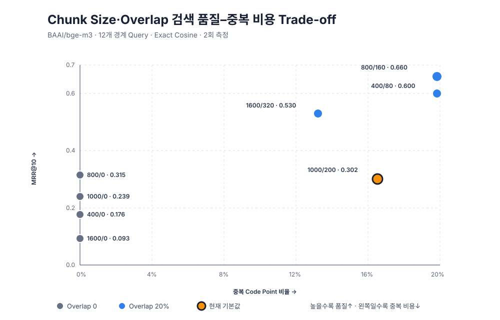

# Chunk Size·Overlap 검색 품질 및 비용 실측 결과

- 관련 이슈: [#147](https://github.com/DocGrid/backend/issues/147)
- 측정 일시: 2026-08-11
- 상태: 실제 BGE-M3 측정 완료
- 원본 데이터: [`gimin-#147-chunk-size-overlap-quality-benchmark-data.json`](./gimin-#147-chunk-size-overlap-quality-benchmark-data.json)

## 1. 결론

결정적 경계 Corpus에서는 모든 20% Overlap Profile이 Answer Coverage 100%를 달성했다. Overlap이
없는 Profile은 근거 문장이 Chunk 경계에서 분리돼 Coverage가 25~75%로 낮아졌다. 따라서 경계 근거
보존에는 Overlap이 효과가 있었다.

검색 순위 품질은 `800/160`이 Hit@3 `66.7%`, MRR@10 `0.660`으로 가장 높았다. 같은 Hit@3를
기록한 `400/80`보다 Chunk 수가 `84 → 48`로 적고 MRR도 높았다. 현재 기본 `1000/200`은 Coverage는
100%지만 Hit@3 `33.3%`, MRR@10 `0.302`로 합성 Corpus의 최적 Profile은 아니었다.

다만 이 결과는 의도적으로 근거를 경계에 배치한 12개 합성 Query의 상대 비교다. 실제 사용자 문서의
길이·질문 분포를 대표하지 않으므로 제품 기본값은 변경하지 않는다. 실제 문서 검색 평가셋으로 재검증한
뒤 별도 설정 변경 PR에서 결정해야 한다.



## 2. 측정 환경

| 항목 | 값 |
|---|---|
| Host | macOS, Apple Silicon `aarch64` |
| Java | 17.0.18 |
| Embedding Model | 실제 `BAAI/bge-m3`, Docker CPU 추론 |
| Vector | Dense 1024차원, 모든 값 유한, 0이 아닌 Norm |
| Corpus | 12문서, 문서당 2,200 Code Point, 총 26,400 Code Point |
| Query | 400·800·1000·1600 경계마다 3개, 총 12개 |
| 검색 | 메모리 내 Exact Cosine, DB·HNSW 제외 |
| Warm-up | 1회 |
| 본 측정 | Profile별 2회, 시작 순서 회전 |
| Model Batch Size | 32 |
| HTTP 요청당 최대 Text | 64 |
| Query Embedding | 12개, 1,010.70ms, 1회 요청 |

## 3. 품질·비용 비교

| Chunk/Overlap | Coverage | Hit@1 | Hit@3 | MRR@10 | Chunk 수 | 중복 비율 | Embedding Median | Embedding p95 | Pareto |
|---|---:|---:|---:|---:|---:|---:|---:|---:|:---:|
| `400/0` | 25.0% | 16.7% | 16.7% | 0.176 | 72 | 0.0% | 31.21s | 37.72s |  |
| `400/80` | 100.0% | 50.0% | 66.7% | 0.600 | 84 | 21.8% | 35.83s | 37.69s |  |
| `800/0` | 50.0% | 25.0% | 33.3% | 0.315 | 36 | 0.0% | 32.31s | 36.31s | ✓ |
| `800/160` | **100.0%** | **50.0%** | **66.7%** | **0.660** | 48 | 21.8% | 41.37s | 43.11s | ✓ |
| `1000/0` | 75.0% | 8.3% | 16.7% | 0.239 | 36 | 0.0% | 43.89s | 44.32s | ✓ |
| `1000/200` 현재 기본 | 100.0% | 25.0% | 33.3% | 0.302 | 36 | 18.2% | 42.38s | 44.59s |  |
| `1600/0` | 75.0% | 0.0% | 0.0% | 0.093 | 24 | 0.0% | 46.14s | 54.39s |  |
| `1600/320` | 100.0% | 50.0% | 50.0% | 0.530 | 24 | **14.5%** | 52.90s | 55.59s | ✓ |

Pareto 표시는 Coverage·Hit@1·Hit@3·MRR@10은 높을수록 좋고 Chunk Code Point 수는 낮을수록
좋다는 기준으로 다른 Profile에 완전히 지배되지 않은 조합이다. 실측 지연은 Host 열 상태의 영향을
받으므로 Pareto 판정에는 결정적인 Chunk Code Point 비용만 사용했다.

## 4. 관찰 결과

### 4.1 Overlap의 경계 근거 복구

- `400/0 → 400/80`: Coverage `25% → 100%`, MRR `0.176 → 0.600`
- `800/0 → 800/160`: Coverage `50% → 100%`, MRR `0.315 → 0.660`
- `1000/0 → 1000/200`: Coverage `75% → 100%`, MRR `0.239 → 0.302`
- `1600/0 → 1600/320`: Coverage `75% → 100%`, MRR `0.093 → 0.530`

모든 크기에서 20% Overlap이 완전한 근거 Chunk를 복구했다. 다만 Coverage 회복이 곧 같은 순위
개선을 뜻하지는 않았다. 큰 Chunk는 질문과 무관한 채움 Text 비율이 높아 `1600/320`의 Coverage가
100%여도 Hit@3는 50%에 머물렀다.

### 4.2 중복·임베딩 비용

- 20% 설정의 실제 중복 비율은 마지막 짧은 Chunk 영향으로 14.5~21.8%였다.
- 가장 작은 `400/80`은 84개 Chunk를 만들었고, `1600/320`은 24개를 만들었다.
- Embedding p95는 36.31~55.59초 범위였다. Text 수뿐 아니라 긴 Sequence의 CPU 추론 비용이
  영향을 주어 큰 Chunk가 항상 빠르지 않았다.
- Exact 검색 p95는 모든 Profile에서 15.78ms 이하였지만 Candidate가 최대 84개인 Micro
  Benchmark라 운영 Vector 검색 성능으로 해석하지 않는다.

### 4.3 현재 기본값 판단

`1000/200`은 경계 근거 보존에는 성공했지만 이번 Corpus에서는 `800/160`보다 Hit@3가 33.4%p,
MRR@10이 0.358 낮았다. 반면 중복 Code Point는 `800/160`보다 960개 적었다. 품질–비용 Trade-off가
있고 실제 문서 평가셋이 없으므로 현재 기본값을 유지한다.

후속 기본값 판단에서는 실제 PDF·DOCX에서 수집한 질문–근거 쌍, 문서 제목·문단 Metadata와 Token
기준 Chunking을 함께 비교해야 한다.

## 5. 재현 방법

```bash
docker compose up -d embedding-server
./gradlew chunkQualityPerformanceTest
```

측정 Round와 Batch Size를 늘릴 때는 다음처럼 실행한다.

```bash
./gradlew chunkQualityPerformanceTest \
  -Dchunk.quality.performance.rounds=3 \
  -Dchunk.quality.performance.batch-size=32 \
  -Dchunk.quality.performance.output=build/reports/chunk-quality/chunk-quality.json
```

기본 출력은 `build/reports/chunk-quality/chunk-quality-latest.json`이다. 이 문서에 연결된 원본 JSON은
성공한 기본 실행 결과를 그대로 보존한다.

## 6. 검증 결과

| 검증 | 결과 |
|---|---|
| Corpus·Ground Truth·Hit@K·MRR 단위 테스트 | ✅ 성공 |
| 일반 회귀 테스트 | ✅ 734개 성공 |
| 실제 BGE-M3 전용 Benchmark | ✅ 11분 25초, 8 Profile × 2 Round 성공 |
| Model명·응답 개수·순서 | ✅ 모두 일치 |
| 1024차원·유한값·0이 아닌 Norm | ✅ 모두 통과 |
| HTTP·계약 실패 | ✅ 0건 |
| Profile별 반복 품질 결정성 | ✅ 모두 일치 |

일반 회귀 테스트는 로컬 PostgreSQL의 SSL 미지원과 필수 테스트 JWT를 반영해 다음 환경으로 실행했다.

```bash
DB_SSLMODE=disable \
JWT_SECRET=docgrid-test-secret-key-for-local-regression-2026 \
./gradlew test
```

## 7. 해석 한계

- 합성 Corpus는 Chunk 경계 손실을 의도적으로 강조한다.
- 12개 Query는 통계적으로 운영 검색 품질을 대표하지 않는다.
- Apple Silicon Docker CPU 절대 지연은 운영 GPU·Rocky Linux 환경과 직접 비교할 수 없다.
- Exact Cosine을 사용했으므로 HNSW Recall과 DB 실행 계획은 포함하지 않는다.
- Parser·OCR·페이지·섹션 Metadata와 RAG 답변 품질은 포함하지 않는다.
- 결과는 파라미터 후보를 좁히는 근거이며 운영 SLO나 기본값 변경 승인이 아니다.
